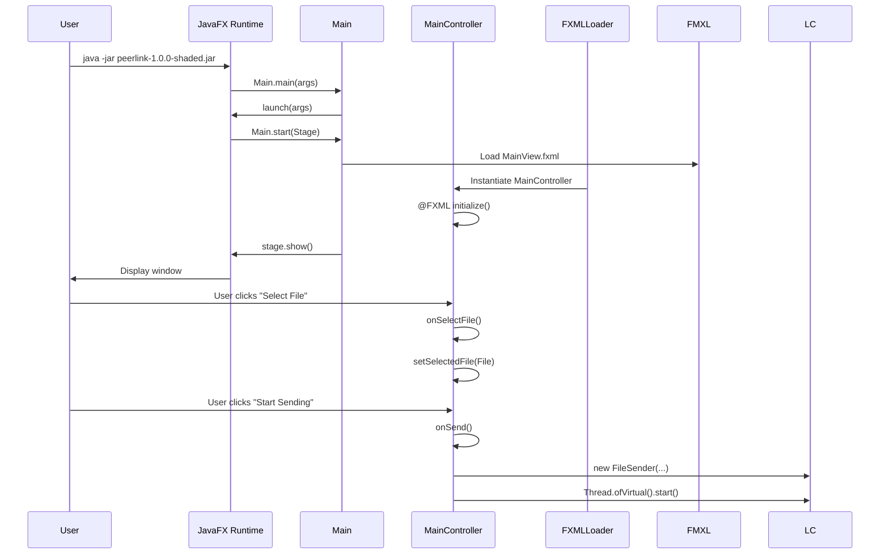
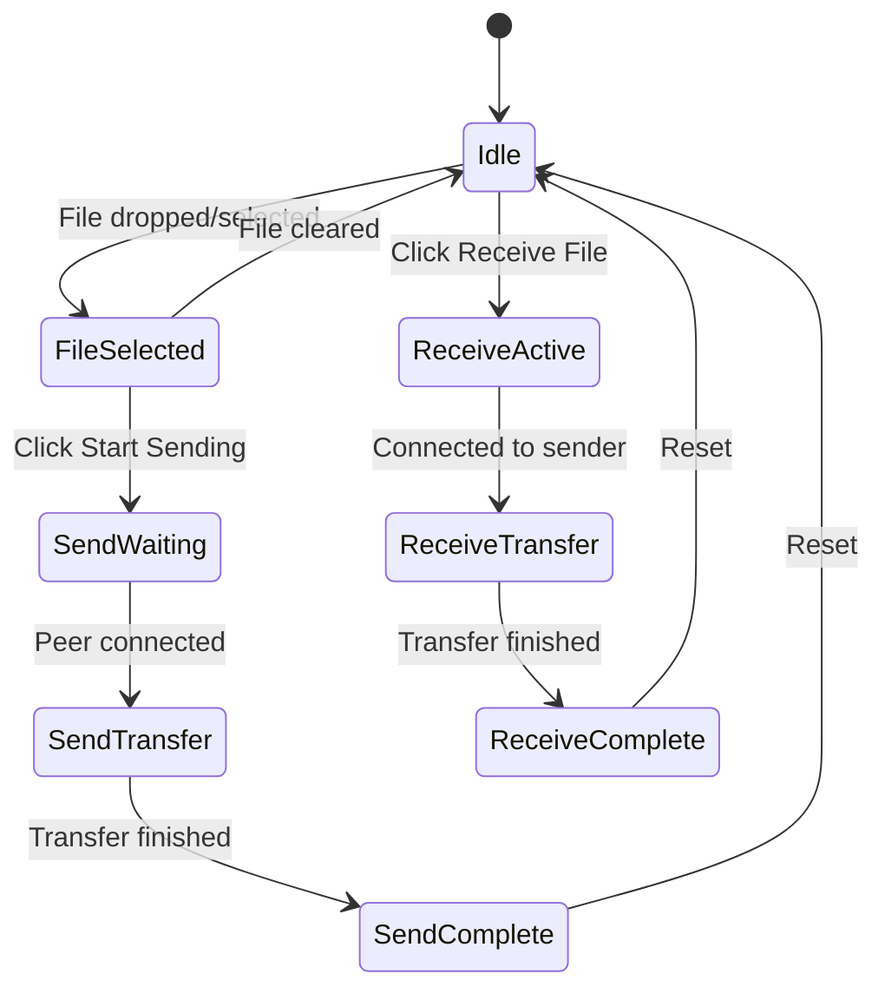
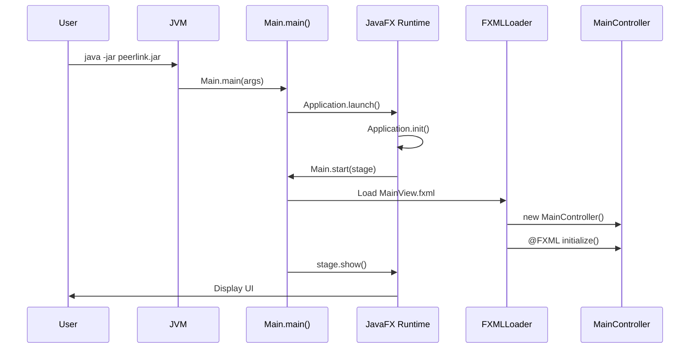
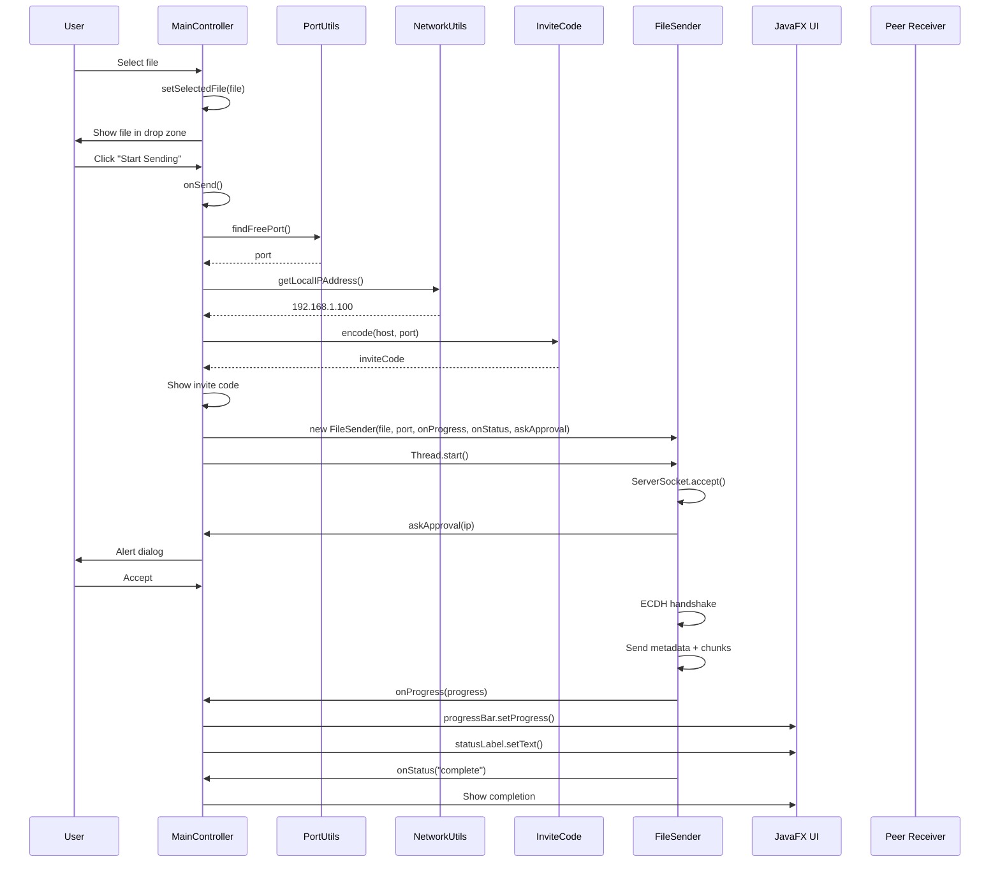

# PeerLink Technical Blueprint

## Project Overview

PeerLink is a secure peer-to-peer file transfer desktop application that enables direct file sharing between devices on the same local network without requiring any intermediary servers. The application implements end-to-end encryption using ECDH key exchange and AES-256-GCM, providing secure file transfers with a minimalist dark-themed JavaFX interface.

---

## High-Level Architecture

```mermaid
graph TB
    subgraph "Client A (Sender)"
        UI[UI Module]
        LC[Logic Module]
        SC[Security Module]
        NI[Network I/O]
    end
    
    subgraph "Client B (Receiver)"
        UI2[UI Module]
        LC2[Logic Module]
        SC2[Security Module]
        NI2[Network I/O]
    end
    
    UI --> LC
    LC --> SC
    SC --> NI
    
    UI2 --> LC2
    NI2 --> LC2
    LC2 --> SC2
    
    NI <==="TCP Socket<br/>Encrypted Stream"==> NI2
```

---

## Step 1: Repository Scan

### Technology Stack

| Category | Technology | Version |
|----------|-----------|---------|
| Language | Java | 21 (required for JavaFX 21) |
| UI Framework | JavaFX | 21.0.3 |
| Build Tool | Apache Maven | 3.x |
| Security | Java Cryptography Architecture | Built-in (EC, AES/GCM) |

### Module Tree

```
com.peerlink/
├── ui/                          # UI Layer
│   ├── Main.java                # JavaFX Application entry point
│   ├── Launcher.java           # Alternative entry (calls Main.main)
│   └── MainController.java     # FXML controller, UI logic
├── security/                   # Security Layer
│   ├── CryptoUtils.java       # Encryption/decryption utilities
│   └── HandshakeManager.java   # ECDH key exchange protocol
└── logic/                      # Business Logic Layer
    ├── FileSender.java         # Sender implementation
    ├── FileReceiver.java    # Receiver implementation
    ├── PortUtils.java      # Port allocation
    ├── NetworkUtils.java   # IP address detection
    ├── InviteCode.java    # Invite code encoding/decoding
    └── TransferStats.java  # Progress tracking DTO
```

### Build Configuration

The project uses Maven with the following key plugins:
- **maven-compiler-plugin**: Compiles Java 21 source code
- **maven-shade-plugin**: Creates shaded JAR with all dependencies
- **javafx-maven-plugin**: Enables JavaFX execution during development
- **jpackage**: Generates native installers for Windows, Linux, macOS

---

## Step 2: Entry Point Analysis

### Primary Entry Point

The application has two entry points defined in `pom.xml`:

1. **Main Entry** (`com.peerlink.ui.Main`): The JavaFX Application class
2. **Launcher Entry** (`com.peerlink.ui.Launcher`): A thin wrapper that calls `Main.main()`

### Runtime Execution Flow



### Boot Sequence Detailed

1. **Application Launch**: `Main.main(String[] args)` calls `launch(args)` inherited from `Application`
2. **Stage Initialization**: `Main.start(Stage stage)` creates the primary window
   - Loads `MainView.fxml` from classpath resources
   - Creates a JavaFX `Scene` with 700x500 dimensions
   - Attaches `peerlink.css` stylesheet to the scene
   - Configures the stage with title "PeerLink", non-resizable
3. **Controller Initialization**: FXMLLoader automatically:
   - Creates a new instance of `MainController`
   - Injects all `@FXML` annotated fields
   - Calls the `initialize()` method (no-argument, runs after injection)
4. **UI Ready**: Application displays the two-panel interface (Send/Receive cards) with status bar

---

## Step 3: Module Breakdown

### 3.1 Security Module

The Security Module provides end-to-end encryption using industry-standard cryptographic primitives.

#### Purpose
- Generate ephemeral EC key pairs for each session
- Perform ECDH key exchange to derive a shared secret
- Encrypt file data using AES-256-GCM

#### Key Components

**CryptoUtils.java**

| Method | Purpose |
|--------|---------|
| `generateECKeyPair()` | Creates secp256r1 EC key pair |
| `deriveSharedKey(PrivateKey, PublicKey)` | ECDH key agreement → SHA-256 → 256-bit AES key |
| `encrypt(byte[], SecretKey)` | AES-GCM encryption with random 12-byte IV |
| `encryptWithIV(byte[], SecretKey, byte[])` | AES-GCM encryption with explicit IV |
| `decrypt(byte[], SecretKey)` | AES-GCM decryption, extracts IV from ciphertext |
| `incrementIV(byte[])` | Increments IV for chunk-based encryption |

**HandshakeManager.java**

| Method | Purpose |
|--------|---------|
| `senderHandshake(DataInputStream, DataOutputStream)` | Sender-side ECDH exchange |
| `receiverHandshake(DataInputStream, DataOutputStream)` | Receiver-side ECDH exchange |

#### Internal Workflow

```
Sender Side:
1. Generate EC key pair (secp256r1)
2. Send my public key (length-prefixed, 4 bytes + key bytes)
3. Receive peer's public key
4. Derive shared secret using ECDH
5. Apply SHA-256 to derive AES-256 key

Receiver Side:
1. Receive peer's public key
2. Generate own EC key pair
3. Send my public key
4. Derive shared secret using ECDH
5. Apply SHA-256 to derive AES-256 key
```

**Data Format**: Each chunk is encrypted as:
```
[12-byte IV][ciphertext + 16-byte GCM tag]
```

---

### 3.2 Logic Module

The Logic Module implements the core P2P file transfer business logic.

#### FileSender

**Purpose**: Listens for incoming connections, performs ECDH handshake, sends file metadata and data.

**Key Methods**:

| Method | Responsibility |
|--------|---------------|
| `cancel()` | Sets cancellation flag, closes sockets |
| `startAndWait()` | Main transfer orchestration |
| `sendMetadata()` | Encrypts and sends filename + file size |
| `sendFileData()` | Streams encrypted file chunks |

**Internal Workflow**:

```java
// Pseudocode for FileSender.startAndWait()
1. Create ServerSocket on available port
2. Set socket timeout (max of 600s or 2s per MB)
3. Loop until cancelled:
   a. Accept incoming connection
   b. Get peer IP, call approvalCallback
   c. If rejected, close socket and continue
   d. Perform ECDH handshake
   e. Send encrypted metadata (filename, size)
   f. Send encrypted file data in chunks
   g. On completion, close and exit
```

**Design Notes**:
- Uses virtual threads (`Thread.ofVirtual()`) for concurrent operations
- Producer/consumer pattern with `BlockingQueue<byte[]>` for disk I/O
- 4MB chunk size with 4MB send/receive buffers
- `TcpNoDelay` enabled for low latency
- Progress reported via callbacks every chunk

#### FileReceiver

**Purpose**: Connects to sender, performs ECDH handshake, receives and saves file data.

**Key Methods**:

| Method | Responsibility |
|--------|---------------|
| `cancel()` | Sets cancellation flag, closes socket |
| `receive()` | Connection and transfer orchestration |
| `receiveFileData()` | Receives metadata, streams file to disk |

**Internal Workflow**:

```java
// Pseudocode for FileReceiver.receive()
1. Connect to sender address (with 3 retries, 500ms delay)
2. Set socket options (buffer sizes, timeout)
3. Perform ECDH handshake
4. Receive encrypted metadata:
   a. Read length prefix (4 bytes)
   b. Validate: 0 < length ≤ 8192 (prevent memory bomb)
   c. Decrypt → extract filename and size
5. Create output file in user's Downloads folder
6. Loop receiving chunks:
   a. Read chunk length
   b. If -1, transfer complete
   c. Validate: 0 < length ≤ 4MB + 28
   d. Decrypt chunk and write to disk
7. Verify total received equals declared file size
```

**Security Features**:
- Strict bounds checking on metadata length (≤8192 bytes)
- Strict bounds checking on chunk length (≤4MB + 28 bytes)
- File saved to user-configured directory (default: ~/Downloads)

#### PortUtils

**Purpose**: Finds an available TCP port for the server socket.

```java
public static int findFreePort() {
    ServerSocket socket = new ServerSocket(0);
    int port = socket.getLocalPort();
    socket.close();
    return port;
}
```

Uses the OS-allocated ephemeral port mechanism: bind to port 0 → get assigned port → close.

#### NetworkUtils

**Purpose**: Detects the local machine's site-local IP address.

**Algorithm**:
1. Enumerate all network interfaces
2. Skip: loopback, down, virtual, docker*, veth*
3. For each remaining interface, find site-local IPv4 address
4. Return first match, fallback to `127.0.0.1`

#### InviteCode

**Purpose**: Encodes/decodes connection strings for human-friendly sharing.

**Encoding Format**:
```
Input:  "192.168.1.100:45678"
Base64 URL-encoded: "MTkyLjE2OC4xLjEwMDo0NTY3OA=="
```

The code uses `Base64.getUrlEncoder().withoutPadding()` to avoid URL-special characters.

#### TransferStats

**Purpose**: Immutable data transfer object for progress reporting.

```java
public class TransferStats {
    public final double progress;      // 0.0 to 1.0
    public final double speedMBps;    // Transfer speed in MB/s
    public final String etaSeconds;  // Estimated seconds remaining
}
```

---

### 3.3 UI Module

The UI Module provides the JavaFX desktop interface.

#### Main

JavaFX Application entry point. Responsible for:
- Creating the primary Stage
- Loading and parsing `MainView.fxml`
- Creating and configuring the Scene
- Attaching CSS stylesheets
- Displaying the window

```java
public class Main extends Application {
    @Override
    public void start(Stage stage) {
        URL resource = getClass().getResource("/com/peerlink/ui/MainView.fxml");
        FXMLLoader loader = new FXMLLoader(resource);
        Scene scene = new Scene(loader.load(), 700, 500);
        scene.getStylesheets().add(getClass().getResource("/com/peerlink/ui/peerlink.css").toExternalForm());
        stage.setTitle("PeerLink");
        stage.setScene(scene);
        stage.setResizable(false);
        stage.show();
    }
}
```

#### MainController

FXML controller that manages all UI state and event handling.

**FXML-Injected Fields**:
- Drop zone components: `dropZone`, `dropZoneLabel`, `dropZoneIcon`, `dropZoneFileInfo`, etc.
- Send card: `sendCard`, `inviteCodeLabel`, `copyCodeBtn`, `sendBtn`
- Receive card: `receiveCard`, `inviteCodeInput`, `pasteCodeBtn`, `receiveProgressSection`
- Status: `statusLabel`, `statusDot`, `progressBar`, `cancelBtn`

**State Variables**:
- `selectedFile`: Currently selected file (or null)
- `currentInviteCode`: Generated invite code for active send session
- `activeSender`: Active FileSender instance
- `activeReceiver`: Active FileReceiver instance

**Event Handlers** (called from FXML via `#methodName`):

| Handler | Trigger |
|---------|---------|
| `onDragOver()` | File dragged over drop zone |
| `onDragDropped()` | File dropped on drop zone |
| `onSelectFile()` | "Select File" button clicked |
| `onSend()` | "Start Sending" button clicked |
| `onReceive()` | "Receive File" button clicked |
| `onCopyCode()` | Copy button clicked |
| `onPasteCode()` | Paste button clicked |
| `onCancel()` | Cancel button clicked |
| `onOpenFolder()` | Open folder button clicked |

**UI State Transitions**:



**File Selection Flow**:
1. User drags file over drop zone → `onDragOver()` adds hover styling
2. User drops file → `onDragDropped()` gets file from dragboard
3. `setSelectedFile(File)`:
   - Shows file info in drop zone
   - Enables "Start Sending" button
   - Adds "drop-zone-active" CSS class

**Send Flow**:
1. `onSend()` called → starts virtual thread
2. Gets local IP address and finds free port
3. Generates invite code → shows in UI
4. Creates `FileSender` with progress/status callbacks
5. Calls `startAndWait()` (blocking)
6. On completion: updates UI to completion state

**Receive Flow**:
1. `onReceive()` called → parses invite code
2. Creates `FileReceiver` with progress/status callbacks
3. Calls `receive()` → connects to sender
4. On completion: updates UI to completion state

**Approval Dialog**:
When a sender receives an incoming connection, the `askApproval(String ip)` method:
1. Creates a JavaFX `Alert` dialog (CONFIRMATION type)
2. Shows on JavaFX Application Thread via `Platform.runLater()`
3. Blocks waiting for user response via `CompletableFuture`
4. Returns `true` if accepted, `false` if declined

---

## Step 4: Core Business Logic

### 4.1 Transfer Protocol

The P2P file transfer follows this wire protocol:

```
Phase 1: Connection
  SENDER                          RECEIVER
     |--------- TCP Connect -------->|
     |<------- TCP Connect ----------|

Phase 2: ECDH Handshake
     |---- [4B len][PubKey A] ----->|
     |<---- [4B len][PubKey B] -----|

Phase 3: Metadata
     |-[4B len][Encrypted Metadata]->|
     |     (filename + file size)   |

Phase 4: Data Transfer
     |      [4B len][Encrypted]---->|
     |      [4B len][Encrypted]---->|
     |             ...              |
     |------------ -1 (end) -------->|

Phase 5: Completion
     |---- Connection Closed ------->|
```

### 4.2 Chunk Encryption

Each file chunk (up to 4MB) is encrypted independently:

1. **IV Generation**: 12-byte random IV for first chunk
2. **Encryption**: AES-256-GCM with 128-bit authentication tag
3. **IV Increment**: For subsequent chunks, IV is incremented as a 12-byte big-endian integer

### 4.3 Invite Code System

The invite code enables two devices to establish a direct TCP connection:

| Component | Description |
|-----------|-------------|
| Host | Local IPv4 address (e.g., "192.168.1.100") |
| Port | TCP port (e.g., "45678") |
| Encoding | Base64 URL encoding without padding |

Example invite code:
```
Original: "192.168.1.100:45678"
Encoded:  "MTkyLjE2OC4xLjEwMDo0NTY3OA=="
```

### 4.4 Progress Calculation

```java
// Speed calculation (after 500ms to stabilize)
speedMBps = (totalSent / 1024.0 / 1024.0) / (elapsedMs / 1000.0);

// ETA calculation
remainingMB = (fileSize - totalSent) / 1024.0 / 1024.0;
etaSec = Math.round(remainingMB / speedMBps);

// Progress
progress = (double) totalSent / fileSize;
```

---

## Step 5: Data Layer

### Persistence Model

PeerLink does **not** use a database. File transfer is direct peer-to-peer.

**File Storage**:
- Files received are saved to `{user.home}/Downloads` directory
- Directory is created if it doesn't exist (`mkdirs()`)

**No State Persistence**:
- Invite codes are ephemeral (generated per session)
- No transfer history stored
- No configuration files written to disk

### Runtime State

All application state exists only in memory during execution:

| State | Storage | Persistence |
|-------|---------|-------------|
| Selected file | `MainController.selectedFile` | Session only |
| Active transfer | `MainController.activeSender/Receiver` | Session only |
| UI elements | FXML-injected fields | Session only |
| Generated invite code | `MainController.currentInviteCode` | Session only |

---

## Step 6: API and Network Protocol

### Network Protocol Summary

Since PeerLink is a P2P application without a server, there is no REST/HTTP API. However, the wire protocol is:

| Operation | Direction | Format |
|-----------|-----------|--------|
| Handshake | Bidirectional | `[4-byte length prefix][X.509 public key]` |
| Metadata | Sender→Receiver | `[4-byte length][AES-GCM encrypted {filename, filesize}]` |
| File chunk | Sender→Receiver | `[4-byte length][AES-GCM encrypted data]` |
| End marker | Sender→Receiver | `-1` (4 bytes, value -1) |

### Socket Configuration

```java
socket.setTcpNoDelay(true);           // Disable Nagle's algorithm
socket.setSendBufferSize(4 * 1024 * 1024);  // 4MB send buffer
socket.setReceiveBufferSize(4 * 1024 * 1024); // 4MB receive buffer
socket.setPerformancePreferences(0, 0, 1); // Prefer low latency
```

### Connection Retry

FileReceiver attempts connection 3 times with 500ms delay between attempts:

```java
int retries = 3;
while (retries > 0 && !cancelled.get()) {
    try {
        activeSocket = new Socket(host, port);
        break;
    } catch (Exception e) {
        retries--;
        if (retries == 0) throw e;
        Thread.sleep(500);
    }
}
```

### Timeout Behavior

| Scenario | Timeout Value |
|----------|--------------|
| Sender waiting for connection | `max(2s per MB, 600s)` |
| Receiver socket | `60000ms` (60 seconds) |

---

## Step 7: UI and Frontend Architecture

### Screen Layout

```
┌─────────────────────────────────────────────────────┐
│● PeerLink                              [Title Bar] │
├─────────────────────────────────────────────────────┤
│ ┌─────────────────────┐   ┌─────────────────────┐    │
│ │ ↑ Send File        P2P│   │ ↓ Receive File ENCR│    │
│ ├─────────────────────┤   ├─────────────────────┤    │
│ │ [Drop Zone     ]  │   │ Enter the invite    │    │
│ │   Drop file here │   │ code from sender  │    │
│ │   or           │   │                   │    │
│ │   [Select File]│   │ ┌─────────────┐   │    │
│ │               │   │ │ [Invite   ][⎙] │    │
│ │               │   │ └─────────────┘   │    │
│ │               │   │                   │    │
│ │ ┌───────────┐ │   │ [↓ Receive]    │    │
│ │ │ YOUR CODE │ │   │                 │    │
│ │ └───────────┘ │   │                 │    │
│ │ [→ Start Send] │   │                 │    │
│ └─────────────────────┘   └─────────────────────┘    │
├─────────────────────────────────────────────────────┤
│ ● Ready to transfer              [Cancel]           │
└─────────────────────────────────────────────────────┘
```

### Visual Components

| Component | Purpose | States |
|----------|---------|--------|
| Drop zone | File input via drag-drop | default, hover, active |
| Invite code display | Shows generated code | hidden, visible |
| Code input | Enter invite code | default, focused, invalid |
| Progress bar | Transfer progress | hidden, visible, animated |
| Status dot | State indicator | idle (gray), send (blue), receive (green), complete (green), error (red) |
| Cancel button | Abort transfer | hidden, visible |

### Design System

**Color Palette** (Zinc-based dark theme):

| Role | Color | Usage |
|------|-------|-------|
| Background | `#0d0d0f` | Window background |
| Surface | `#18181b` | Card backgrounds |
| Primary | `#3b82f6` | Send actions, progress |
| Success | `#22c55e` | Receive actions |
| Danger | `#ef4444` | Cancel/error |
| Text Primary | `#fafafa` | Headings |
| Text Secondary | `#e4e4e7` | Body text |
| Text Muted | `#71717a` | Hints, status |
| Code Text | `#a5b4fc` | Invite codes |

### UI Threading Model

All JavaFX operations run on the JavaFX Application Thread. Network operations run on virtual threads:

```java
// On button click
Thread.ofVirtual().start(() -> {
    // Background work (network I/O)
    FileSender sender = new FileSender(...);
    sender.startAndWait();
    
    // UI updates must run on JavaFX thread
    Platform.runLater(() -> {
        progressBar.setProgress(stats.progress);
    });
});
```

---

## Step 8: Build and Compilation Pipeline

### Prerequisites

| Requirement | Version |
|-------------|---------|
| Java JDK | 21 (required) |
| Maven | 3.x |
| OS-specific tools | See below |

### Build Profiles

| Profile | OS | Output |
|--------|-----|--------|
| (default) | All | Shaded JAR |
| `-P linux` | Linux | .deb, .rpm |
| `-P mac` | macOS | .dmg |
| `-P windows` | Windows | .exe, .msi |

### Build Commands

```bash
# Build shaded JAR only
mvn clean package -DskipTests

# Run locally
java -jar target/peerlink-1.0.0-shaded.jar

# Build for Windows
mvn clean install -P windows

# Build for Linux
mvn clean install -P linux

# Build for macOS
mvn clean install -P mac
```

### Maven Build Phases

1. **compile**: Compiles Java sources to `target/classes`
2. **process-resources**: Copies resources to `target/app-resources`
3. **package**: Creates JAR with shade plugin
4. **install**: Runs jpackage to create native installers

### Output Artifacts

| Artifact | Location |
|----------|----------|
| Regular JAR | `target/peerlink-1.0.0.jar` |
| Shaded JAR | `target/peerlink-1.0.0-shaded.jar` |
| Windows installer | `dist/windows/PeerLink-1.0.0.exe` |
| Linux .deb | `dist/linux/peerlink_1.0.0_amd64.deb` |
| Linux .rpm | `dist/linux/peerlink-1.0.0-1.x86_64.rpm` |
| macOS .dmg | `dist/mac/PeerLink-1.0.0.dmg` |

### JAR Manifest

The shaded JAR includes:
- Main-Class: `com.peerlink.ui.Main`
- Add-Opens: `java.base/java.lang=ALL-UNNAMED`

---

## Step 9: Runtime Flow Diagrams

### Application Startup



### Send File Sequence



### Receive File Sequence

```mermaid
sequenceDiagram
    participant User
    participant Ctrl as MainController
    participant IC as InviteCode
    participant FR as FileReceiver
    participant UI as JavaFX UI
    participant Sender as Peer Sender
    
    User->>Ctrl: Enter invite code
    Ctrl->>Ctrl: Parse code
    
    User->>Ctrl: Click "Receive File"
    Ctrl->>Ctrl: onReceive()
    Ctrl->>IC: decode(code)
    IC-->>Ctrl: ["192.168.1.100", "45678"]
    
    Ctrl->>FR: new FileReceiver(host, port, saveDir, onProgress, onStatus)
    Ctrl->>FR: Thread.start()
    
    FR->>Sender: Socket connect()
    FR->>Sender: ECDH handshake
    FR->>Sender: Receive metadata
    FR->>UI: onStatus("Receiving file...")
    
    rectrgb(200, 240, 200)
    loop Chunk Transfer
        Sender->>FR: Send encrypted chunk
        FR->>FR: Decrypt and write
        FR->>Ctrl: onProgress(progress)
        Ctrl->>UI: progressBar.setProgress()
    end
    
    FR->>UI: onStatus("complete")
    Ctrl->>UI: Show completion
```

---

## Step 10: Configuration and Environment

### Configuration Files

The application has minimal configuration:

| File | Purpose |
|------|---------|
| `pom.xml` | Build configuration |
| `src/main/resources/com/peerlink/ui/MainView.fxml` | UI layout |
| `src/main/resources/com/peerlink/ui/peerlink.css` | Primary stylesheet |
| `src/main/resources/com/peerlink/ui/styles.css` | Secondary stylesheet (backup) |

### Runtime Properties

| Property | Default | Usage |
|----------|---------|-------|
| `user.home` | System property | Download directory base |
| `java.version` | 21 | Java version check |

### No Environment Variables Required

The application requires no environment variables. All configuration is runtime-derived.

### Default Download Location

```java
File saveDir = new File(System.getProperty("user.home"), "Downloads");
```

This resolves to:
- Linux/macOS: `~/Downloads`
- Windows: `C:\Users\<username>\Downloads`

### Network Interface Filtering

NetworkUtils filters out interfaces by name prefix:
- Skip: `docker*`, `veth*`
- Skip: loopback, down, virtual interfaces

---

## Step 11: Error Handling and Logging

### Error Handling Strategy

| Layer | Behavior |
|-------|-----------|
| Network errors | Display in status label, reset UI |
| Protocol errors | Throw exception, display message |
| Disk errors | Catch, display message, cancel transfer |
| Cryptographic errors | Throw exception (typically unrecoverable) |

### Status States

| State | Status Color | Description |
|-------|-------------|-------------|
| `idle` | Gray (dot) | Ready, no transfer |
| `send` | Blue (dot) | Sending in progress |
| `receive` | Green (dot) | Receiving in progress |
| `complete` | Green (dot) | Transfer succeeded |
| `error` | Red (dot) | Error occurred |

### Status Messages

Examples of status messages displayed:
- "Ready to transfer"
- "Waiting for connection..."
- "Performing secure handshake..."
- "Sending file metadata..."
- "Sending... 45%"
- "Receiving file: document.pdf (2.5 MB)"
- "Receiving... 67%"
- "Transfer complete!"
- "Error: Connection timed out."
- "Error: Invalid invite code."

### Error States

| Error | Handling |
|-------|----------|
| File not found | Not possible (only selected at runtime) |
| Connection refused | 3 retries, then error display |
| Connection timeout | Sender timeout, display error |
| Memory bomb (large metadata) | Validation check, throw exception |
| Disk full | Catch IOException, display error, cancel |
| Invalid invite code | Throw during decode, shake input |

### Cancel Mechanism

Both FileSender and FileReceiver support cancellation:

```java
public void cancel() {
    cancelled.set(true);
    try { if (serverSocket != null) serverSocket.close(); } catch (Exception ignored) {}
    try { if (activeSocket != null) activeSocket.close(); } catch (Exception ignored) {}
}
```

The `cancelled` flag is checked in all loops.

---

## Step 12: Testing

### Test Coverage

**No tests exist** in this repository. The AGENTS.md file explicitly states: "No test sources exist in this repo"

### Manual Testing Approach

To verify functionality:

1. **Build**: `mvn clean package -DskipTests`
2. **Run two instances** on same machine (different ports):
   ```bash
   java -jar target/peerlink-1.0.0-shaded.jar &
   java -jar target/peerlink-1.0.0-shaded.jar &
   ```
3. **Send**: Select file in one instance, share invite code
4. **Receive**: Paste code in other instance, click Receive

---

## Step 13: Security Review

### Security Features

| Feature | Implementation |
|---------|---------------|
| Key exchange | ECDH (secp256r1) |
| Data encryption | AES-256-GCM |
| Authentication tag | 128-bit GCM tag |
| IV handling | Random per-session, increment per-chunk |
| Memory protection | Strict length bounds on protocol |
| File destination | User's Downloads only |

### Security Analysis

**Strengths**:
- No server involvement (no中间截获)
- Ephemeral keys (unique per session)
- Authenticated encryption with GCM tag
- Strict protocol validation prevents memory bombs

**Potential Concerns**:
1. **No certificate pinning**: Any device on local network can initiate connection (mitigated by approval dialog)
2. **Man-in-the-middle within LAN**: Not protected by the protocol (assumes trusted local network)
3. **No password protection**: Application has no authentication (by design - for local network use)
4. **File overwrite**: Received files overwrite existing files with same name (no confirmation)

### Safety Mechanisms

Bounds checking on protocol:
```java
if (metaLen <= 0 || metaLen > 8192) {
    throw new Exception("Protocol error: Invalid metadata length. Possible memory bomb.");
}

if (nameLen <= 0 || nameLen > 4096) {
    throw new Exception("Protocol error: Invalid filename length.");
}

if (chunkLen <= 0 || chunkLen > 4 * 1024 * 1024 + 28) {
    throw new Exception("Protocol error: Invalid chunk length limit exceeded.");
}
```

---

## Step 14: Performance and Scalability

### Performance Characteristics

| Metric | Value |
|--------|-------|
| Chunk size | 4 MB |
| Socket buffer | 4 MB each direction |
| Encryption overhead | ~28 bytes per chunk (12 IV + 16 GCM tag) |
| Virtual threads | Used for network I/O |

### Optimization Techniques

1. **Virtual threads**: Java 21 virtual threads avoid thread stack overhead
2. **Buffered I/O**: 4MB buffers reduce system calls
3. **Nodelay**: TCP_NODELAY disables Nagle's algorithm
4. **Producer/consumer**: BlockingQueue decouples disk I/O from network
5. **Memory-mapped style**: 4MB chunks balance memory vs. efficiency

### Potential Bottlenecks

1. **Disk I/O speed**: Actual transfer limited by disk write speed
2. **Network bandwidth**: Local network bandwidth (typically 100 Mbps - 1 Gbps)
3. **Encryption**: AES-GCM is fast but not zero-cost (~50 MB/s on modern CPUs)

### Scalability

PeerLink is designed for **single-file, single-recipient** transfers:
- Not suitable for broadcast/multicast
- No concurrent sender/receiver within same instance
- One transfer at a time per application instance

---

## Step 15: Final Executive Summary

### Project Summary in 20 Lines

PeerLink is a secure peer-to-peer file transfer application built with JavaFX 21. It enables direct file sharing between devices on the same local network without requiring any intermediary server. The application uses ECDH key exchange to establish a shared secret, then encrypts all file data using AES-256-GCM with ephemeral keys generated per session. The UI presents two simple panels: one for sending files (with drag-and-drop and code generation) and one for receiving files (with code input). Files are saved to the user's Downloads directory with the original filename preserved. Security measures include strict protocol validation to prevent memory bomb attacks and an approval dialog that prompts users before accepting incoming connections. Build produces both a runnable JAR and native installers for Windows, Linux, and macOS using Maven and jpackage.

### What Makes This Project Unique

1. **Serverless architecture**: True peer-to-peer - files go directly from sender to receiver with no cloud storage or relay servers
2. **Minimal attack surface**: No external network exposure since both parties must be on the same local network
3. **Ephemeral security keys**: A fresh key pair is generated for each transfer session, discarded after use
4. **Single-purpose design**: The entire application focuses on one task - getting a file from A to B securely

### What a Developer Should Learn First

1. **MainController.java**: The central state machine handling all user interactions
2. **FileSender.java / FileReceiver.java**: Understanding the protocol and threading model
3. **Security layer**: How ECDH handshake and AES-GCM encryption work together

### How to Extend the Project Safely

1. **Add features in new methods**: Don't modify existing handlers without understanding the state machine
2. **Threading discipline**: Any network/disk I/O must run on virtual threads; all UI updates via `Platform.runLater()`
3. **Protocol changes**: If modifying the wire protocol, maintain backward compatibility or implement version negotiation
4. **UI changes**: The FXML IDs are the contract - don't rename them without updating the controller

### Common Mistakes Contributors Will Make

1. **UI updates from background threads**: Directly updating JavaFX properties from network threads will throw exceptions
2. **Blocking the JavaFX thread**: Long-running operations must use virtual threads (already implemented)
3. **Ignoring cancellation**: Network operations must check the `cancelled` flag in loops
4. **Forgetting to close sockets**: Use try-with-resources or finally blocks for socket cleanup
5. **Not validating protocol bounds**: Accepting unchecked lengths leads to memory exhaustion vulnerabilities
6. **Assuming single instance**: The code handles one transfer at a time - don't assume concurrent transfers work